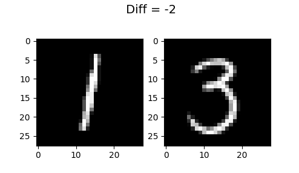

# MnistOpe

The goal of this project is to create an operation network that work on Mnist Dataset.

# Project goals

1. Create a sum network that work on Mnist Dataset.


```model(im1, im2) = im1 + im2```

2. Create a general (Sum + Diff) network that work on Mnist Dataset.



```model(im1, im2, ope) = ope(im1,im2) ```

# Project Structure

```
| - README.md
| - LICENSE
| - .gitignore
|
| - classifier   (It's not my work : Source from [https://github.com/pytorch/examples/blob/00ea159a99f5cb3f3301a9bf0baa1a5089c7e217/mnist/main.py](Pytorch example) )
|   | - main.py       (Run it with ```python main.py --help```)
|   | - dataloader.py (Download data inside the data directory)
|   | - models.py     (Simple LeNet Classifier for MNIST)
|   | - train.py      (Train function called in main.py) 
|   | - test.py       (Test function called in main.py)
|
| - data
|   | - MNIST     (Downloaded data)
|   |   | - raw
|   |   |   |  - train-images-idx3-ubyte.gz
|   |   |   |  - train-labels-idx1-ubyte.gz
|   |   |   |  - t10k-images-idx3-ubyte.gz
|   |   |   |  - t10k-labels-idx1-ubyte.gz
|
| - sum_classifier (This is my work : Implement a simple LeNet + Concatenation Sum Classifier for MNIST)
|   | - main.py       (Run it with ```python main.py --help```)
|   | - dataloader.py (Download data inside the data directory + Create a custom dataloader (2 images + label the sum))
|   | - models.py     (Custom SumNet classifier (Takes 2 images + return the sum))
|   | - train.py      (Train function called in main.py)
|   | - test.py       (Test function called in main.py)
|
| - ops_classifier (This is also my work : Implement a simple LeNet + Concatenation Ops Classifier for MNIST)
|   | - main.py       (Run it with ```python main.py --help```)
|   | - dataloader.py (Download data inside the data directory + Create a custom dataloader (2 images + 1 operator + label the sum))
|   | - models.py     (Custom OpNet classifier (Takes 2 images and an operator + return operator(im1, im2)))
|   | - train.py      (Train function called in main.py)
|   | - test.py       (Test function called in main.py)
|
| - weights
|   | - classifier
|   |   | - weights.pth   (Weights for the basic classifier)
|   | - sum_classifier
|   |   | - weights.pth   (Weights for the sum classifier)
|   | - ops_classifier
|   |   | - weights.pth   (Weights for the ops classifier)
```
# Main tricks

1. **Custom Dataloader** (2 images + label the sum) : dataloader.py 

Each ```batch = (im1, im2, ope, label)```

We shuffled mnist train dataset (60k imgs) and make sure that one epoch contains all the data once on the left side 
and once on the right

2. **Model representation**

2.1 For SumNet :

```model(im1, im2) = im1 + im2```
Encoder = LeNetEncoder

```embedding_dim = 128```

```im1_embedding = Encoder(im1)```

```im2_embedding = Encoder(im2)```

then we concatenete both embedding in a simple feedforward network :

```concatenation = cat(im1_embedding, im2_embedding)```

``` output = LogSoftmax(Linear(256, 18))(concatenation)```

2.2 For OpNet :

Same thing as SumNet but with an operator :

```concatenation = cat(im1_embedding, im2_embedding, ope_embedding)```

with ```ope_embedding = [1] if ope = Sum and [-1] if ope = Diff```

```output = LogSoftmax(Linear(concatenation, 27))```

3. **Target**
    
```target = label + 9 for the OpNet and label for SumNet``` (We dont want to have a negative target for the OpNet)

4. **Training**

```Loss : nll_loss (= CrossEntropyLoss) --> We add a weight because the dataset is not balanced```

For OpNet :

```python
sum_freq = np.array([0.0 for _ in range(9)] + [min(k + 1, 19 - k) / 200 for k in range(19)])
diff_freq = np.array([(10 - abs(k)) / 200 for k in range(-9, 10)] + [0.0 for _ in range(9)])
all_freq = sum_freq + diff_freq
inverse_freq = 1 / all_freq
weight = torch.tensor(inverse_freq, dtype=torch.float32)
```

Learning rate, Sheduler, and optimizer = Same as reference [Pytorch example](https://github.com/pytorch/examples/blob/00ea159a99f5cb3f3301a9bf0baa1a5089c7e217/mnist/main.py)


# Evaluation and Performance

(See evaluation.ipynb)


# References

https://arxiv.org/pdf/1912.03035.pdf

